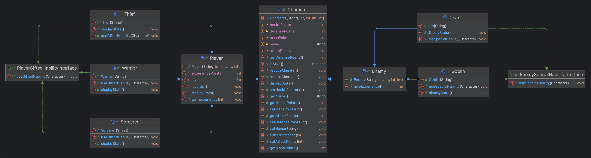

# TD7 JAVA - Training POO 2

## Objectifs

- Les concepts d’interfaces en Java.
- La lecture et l’interprétation d’un diagramme de classe.
- L’implémentation d’un diagramme de classe simple.
- La refactorisation du code afin d’améliorer sa modularité et sa maintenabilité.

Vous travaillerez sur une application de gestion de véhicules. L’exercice se découpe en trois parties progressives.

## Enoncé

Implémenter le diagramme de classe suivant:

